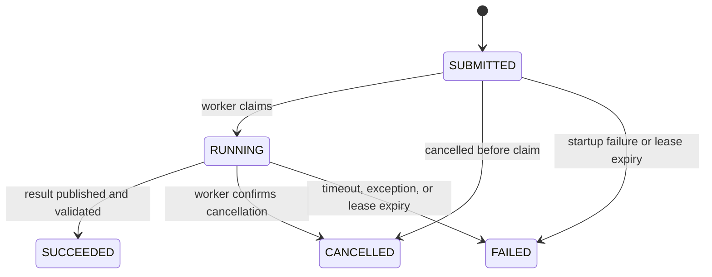

# Backtest jobs and results

[中文页面](jobs.zh-CN.md)

## Request protocol

The runtime accepts four request versions. v1 and v2 use `native.position_replay`, v3 uses `native.sequenced_execution`, and v4 uses `native.trade_accounting`.

| Version | Purpose | Required conditions | Result format |
| --- | --- | --- | --- |
| v1 | Diagnostic replay | `evidence_tier=diagnostic` | `ticknet.backtest_job_result.v1` |
| v2 | Replay with an execution ledger | `evidence_tier=execution_aware`, complete research clock, producer identity, and an enabled ledger | `quant.backtest_job_result.v2` |
| v3 | Multi-decision execution diagnostics | `evidence_tier=diagnostic`, one research clock per rebalance, and an enabled ledger | `ticknet.backtest_job_result.v1` |
| v4 | Trade-cost accounting for one weight adjustment | `evidence_tier=diagnostic`, content-hashed input, and non-negative finite rates | `quant.trade_accounting_result.v1` |

v2 requires both `execution.ledger=true` and `execution.ledger_config.enabled=true`. A production request may include `quant_run_manifest_ref`, which points to a typed `QuantRunManifest` in the same artifact store. Submission and worker validation checks the manifest and the content hashes of its `component_refs`; successful results preserve the validated root manifest for downstream review. See the [v2 request example](https://github.com/runchengxie/quant-backtest-runtime/blob/main/examples/request-v2.json) and [`contracts.py`](https://github.com/runchengxie/quant-backtest-runtime/blob/main/src/backtest_runtime/contracts.py).

v3 accepts `positions_ref`, `pricing_ref`, and `decision_clocks_ref`. The first two are Parquet files; the clock input is a JSON object no larger than 1 MiB keyed by rebalance date. All three use `artifact://sha256/<digest>`. The hashes in the [v3 request example](https://github.com/runchengxie/quant-backtest-runtime/blob/main/examples/request-v3.json) are placeholders and must be replaced with real input hashes before submission. Each date requires a complete `research.clock.v1`; the backend checks target, entry, and valuation dates.

v4 `accounting_ref` points to a Parquet table with `symbol`, `previous_weight`, `target_weight`, `previous_price`, `current_price`, and `tradable`. `config` contains only `commission_rate`, `stamp_tax_rate`, and `slippage_rate`; `execution` is an empty object. The hashes in the [v4 request example](https://github.com/runchengxie/quant-backtest-runtime/blob/main/examples/request-v4.json) are placeholders. This diagnostic convention does not represent actual execution.

Request files must be ordinary JSON files no larger than 64 KiB. `idempotency_key` must contain 1–128 safe ASCII characters. Reusing a key with the same request returns the existing job; binding the key to different content is an error. Use a new key when changing parameters.

Inputs use `artifact://sha256/<digest>` and are stored below `<artifact-root>/sha256/<digest>`. v1 and v2 require `positions_ref`, `pricing_ref`, and `periods_ref`; `intraday_bars_ref` is optional. The worker verifies each input SHA-256 before reading it. Callers own input creation and immutability.

`budgets.wall_seconds` ranges from 1 to 86400 and `budgets.memory_mb` from 256 to 65536. The memory limit covers the process virtual address space, including imported dependencies. A job fails when resource limits cannot be applied.

## Research clocks

v2 callers provide a complete `research.clock.v1`. A v2 job represents one decision. The `rebalance_date` in the positions and periods tables must equal the information cutoff date, and the entry date must fall within the earliest order date and the end of the execution window. Pricing data may not be later than the valuation date. The runtime also checks order, fill, and NAV dates.

Research clocks do not prove an intraday fill time. Callers must provide a window covering the complete replay period and separately establish that signal inputs were available at the cutoff.

## State and recovery

Cancellation first records a request and then signals the worker confirmed to belong to the job. A completed job does not change state because of a repeated cancellation. `recover` handles expired leases; `submit` and `status` also trigger recovery. There is no resident scheduler, so unattended environments should run `recover` periodically.

## Results and provenance

The worker publishes results to a task-specific directory and stores a manifest hash in SQLite. `result` validates job identity, request fingerprint, manifest hash, and every result-file hash before returning metadata. Modified files are rejected.

v1 and v3 results contain five diagnostic tables. v2 contains the platform `portfolio_backtester.backtest_result.v1` result package. v4 contains a one-row cost table. A successful job means that its result has been published and validated; it does not promote a strategy. Research promotion still requires source review and human approval in the research layer.
