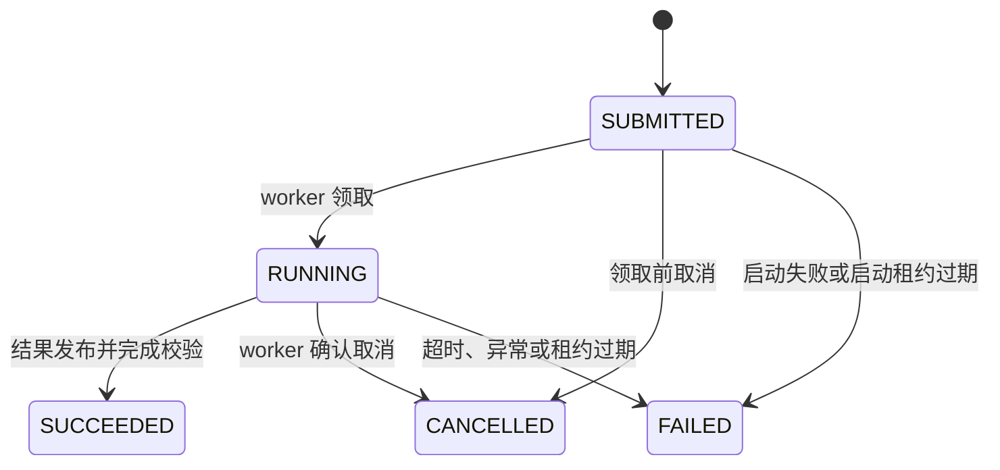
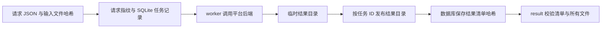

# 回测任务与结果

## 请求协议

运行时接受四种请求。v1 和 v2 使用 `native.position_replay`，v3 使用 `native.sequenced_execution`，v4 使用 `native.trade_accounting`。

| 请求版本 | 用途 | 必要条件 | 结果格式 |
| --- | --- | --- | --- |
| v1 | 诊断回放 | `evidence_tier=diagnostic` | `ticknet.backtest_job_result.v1` |
| v2 | 带执行账本的回放 | `evidence_tier=execution_aware`、完整研究时钟、生产者身份、开启账本 | `quant.backtest_job_result.v2` |
| v3 | 多次决策的执行诊断 | `evidence_tier=diagnostic`、每次调仓各自的研究时钟、开启账本 | `ticknet.backtest_job_result.v1` |
| v4 | 单次权重调整的交易成本结算 | `evidence_tier=diagnostic`、内容哈希输入、非负有限费率 | `quant.trade_accounting_result.v1` |

v2 同时要求 `execution.ledger=true` 和 `execution.ledger_config.enabled=true`。完整字段见 [v2 请求示例](../examples/request-v2.json)，校验实现见 [contracts.py](../src/backtest_runtime/contracts.py)。不支持的字段会被拒绝，避免拼写错误被默默忽略。

v3 接受 `positions_ref`、`pricing_ref` 和 `decision_clocks_ref`。前两者为 Parquet，时钟输入为不超过 1 MiB 的 JSON 对象，以调仓日期为键；三者均使用 `artifact://sha256/<digest>`。[v3 请求示例](../examples/request-v3.json)中的哈希仅为占位，提交前须写入真实输入文件并替换引用。每个日期须有独立且完整的 `research.clock.v1`，平台后端会核对目标、入场与估值日期。v3 保留诊断证据等级，不把缺少来源可见性证明的历史回放标记为正式执行证据。

v4 的 `accounting_ref` 指向一张 Parquet 表，列为 `symbol`、`previous_weight`、`target_weight`、`previous_price`、`current_price` 和 `tradable`。`config` 仅含 `commission_rate`、`stamp_tax_rate` 和 `slippage_rate`，`execution` 为空对象。[v4 请求示例](../examples/request-v4.json)中的哈希为占位。平台后端按价格漂移后的权重计算成交与成本，runtime 保存单行 `accounting.parquet` 与哈希清单；`result` 验证后返回换手及分项成本。此诊断口径不代表真实成交。

请求文件必须是普通 JSON 文件，大小不超过 64 KiB。`idempotency_key` 为 1 至 128 个安全 ASCII 字符。同一键和同一请求重复提交返回已有任务，同一键绑定不同内容时会报冲突。修改参数后重跑应使用新键。

输入采用 `artifact://sha256/<digest>`，对应文件位于 `<artifact-root>/sha256/<digest>`。v1 和 v2 要求 `positions_ref`、`pricing_ref` 和 `periods_ref`，`intraday_bars_ref` 可选；v3 和 v4 的输入见上文。worker 读取输入前会校验文件 SHA-256。调用方负责把输入写入该目录并保持不可变。

`budgets.wall_seconds` 取值为 1 至 86400，`budgets.memory_mb` 取值为 256 至 65536。内存限制约束进程虚拟地址空间，导入依赖也会占用预算。无法设置资源限制时任务失败。

## 研究时钟

v2 由调用方提供完整的 `research.clock.v1`。一个 v2 Job 对应一次决策，持仓和周期表的 `rebalance_date` 必须等于信息截止日期，入场日期必须落在最早下单日至执行窗口结束日之间。定价数据不得晚于估值日。运行时还会检查订单、成交和净值日期。多次调仓须分别提供各自的决策时钟，不能用一个跨年时钟代表每个历史信号。调用方仍须证明信号输入在截止时点已可用，日期校验本身无法替代数据来源审计。

原生回放的成交时间只有日期精度。研究时钟不能证明具体的日内成交时刻，调用方提供的窗口必须覆盖完整回放期间。

## 状态与恢复

运行中取消先记录取消请求，再向确认属于该任务的 worker 发信号。已经完成的任务不会因为重复取消而改变状态。取消请求写入后，成功状态更新不能覆盖它。

worker 领取任务后，租约截止时间为领取时间加 `wall_seconds` 再加 30 秒。CLI 启动 worker 时另设 60 秒的启动租约。`recover` 处理过期租约，`submit` 和 `status` 也会触发恢复。没有常驻调度器，长期无人查询的环境应定时执行 `recover`。

回收运行中的过期任务时，会先核对 `/proc` 中的命令和任务 ID，再通过 pidfd 终止并确认进程退出。读取 `/proc` 失败或无法完成终止时保留状态，供后续恢复和排查。确认进程已经退出，或 PID 对应其他进程时，会结束过期任务并清理未发布结果，保留无关进程。

## 结果与来源关系

v1 和 v3 结果包含五张诊断表。v2 结果包含平台的 `portfolio_backtester.backtest_result.v1` 标准结果包。v4 结果包含单行成本表。`result` 会校验任务身份、请求指纹、清单哈希和结果文件哈希，再返回元数据。发现文件被修改时会报错。

回测任务成功表示结果已完成发布。研究晋升还需要调用方关联独立的根 `ResearchRunManifest`，并完成研究侧的来源核对和审批。
